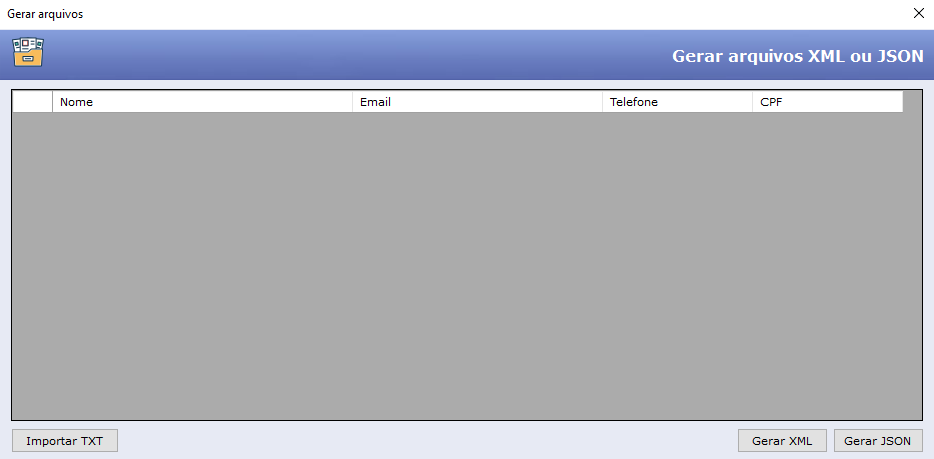

# GERAR ARQUIVOS XML ou JSON C#
 
<h1 align="center">
    
</h1>
 

## SOFTWARE UTILIZADO 
- Visual Studio 2022
- Linguagem C# windows forms

# CarregarGridAlunos
 
Este método carrega dados em um DataGridView. Primeiro, ele limpa as linhas existentes, então chama o método LerArquivoTXT para ler dados de um arquivo de texto (arquivoTXT) e populaciona o DataGridView com eles. Após carregar os dados, ele define várias propriedades do DataGridView para controlar sua aparência e o atualiza.

# LerArquivoTXT
 
Este método privado lê dados de um arquivo de texto e populaciona o DataGridView com eles. Primeiro, ele limpa as linhas existentes, lê cada linha do arquivo de texto, divide-a em campos de dados individuais usando ';' como delimitador, e então adiciona uma nova linha ao DataGridView para cada linha de dados. Se o número de campos de dados em qualquer linha não for igual a 4, ele exibe uma mensagem de erro.

# GerarXML
 
Este método exporta os dados do DataGridView para um arquivo XML. Ele cria um documento XML, cria o elemento raiz ("Dados"), itera por cada linha do DataGridView, cria um elemento XML para cada linha, adiciona elementos filhos ("Item") para cada célula na linha, e finalmente salva o documento XML em um arquivo.

# GerarJSON
 
Este método exporta os dados do DataGridView para um arquivo JSON. Ele cria uma lista de dicionários para armazenar os dados, onde cada dicionário representa uma linha de dados. Itera por cada linha do DataGridView, cria um dicionário para cada linha, adiciona pares chave-valor para cada célula na linha, serializa a lista de dicionários para o formato JSON usando Newtonsoft.Json, e então salva os dados JSON em um arquivo.
